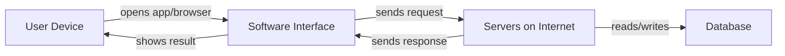

# Chapter 1: Understanding Software

## Learning Objectives

By the end of this chapter, you should be able to:

1. Define software in professional language and explain it to a non-technical person.
2. Identify software you already use every day and classify what kind it is.
3. Distinguish major software types used in industry (system, application, web, mobile, desktop, SaaS, embedded, AI-powered).
4. Explain why understanding software types matters for product decisions and career choices.
5. Recognize modern trends (SaaS, cloud software, AI features) without confusing them with older software forms.

---

## 1. Why This Matters

Every career in this program starts with one idea: **software is how modern businesses deliver value**.

You already use software before breakfast:

* an alarm on your phone;
* UPI or banking apps;
* WhatsApp or Instagram;
* Google Maps;
* a college or company portal.

As an **AI-powered full-stack developer**, you will not just use software — you will help **create** it.

If you do not understand what software is and how it is categorized, you will struggle to:

* choose the right product form (website vs mobile app vs SaaS);
* talk clearly with clients, founders, and teammates;
* write good requirements;
* use AI tools effectively (because AI needs clear context).

This chapter builds the vocabulary and mental model for the rest of Module 1 and the full curriculum.

---

## 2. Core Concepts

### 2.1 What Is Software?

**Software** is a set of instructions that tells a computer (or phone, tablet, server, or smart device) what to do.

**Hardware** is the physical machine (laptop, phone, server).  
**Software** is the invisible program that makes the hardware useful.

| Term | Meaning | Example |
|------|---------|---------|
| Hardware | Physical device | Phone, laptop, server |
| Software | Instructions/programs | Instagram, Chrome, Windows |
| Data | Information processed by software | Your messages, photos, orders |

**Definition → Explanation → Example → Real-world use**

* **Definition:** Software = programmed instructions that perform tasks.
* **Explanation:** Without software, a laptop is metal and glass. With software, it becomes a tool for work, communication, entertainment, and business.
* **Example:** A calculator app takes numbers (input), follows calculation rules (instructions), and shows a result (output).
* **Real-world use:** Flipkart software manages product listings, carts, payments, delivery tracking, and customer support.

**Technical term → plain English:**

**Application (app)** = a software program designed for end users to accomplish a task (chat, pay, book, learn).

---

### 2.2 Software Around Us

Software is not only "tech company products." It is everywhere:

| Area | Software examples |
|------|-------------------|
| Communication | WhatsApp, Gmail, Zoom |
| Commerce | Amazon, Swiggy, Paytm |
| Transport | Uber, IRCTC, Google Maps |
| Education | LMS portals, Google Classroom |
| Health | Hospital management systems, fitness apps |
| Entertainment | Netflix, Spotify, YouTube |
| Work | Microsoft Word, Slack, Notion, Excel |
| Government | DigiLocker, passport portals, tax filing systems |

**Key insight for developers:**  
Almost every modern business problem can be improved with software — but only if you understand **who the user is** and **what problem** needs solving. Modules 2 and 3 will go deeper into that.

---

### 2.3 Types of Software

There are many valid ways to classify software. As a junior developer, learn these practical categories.

#### A) By role in the computer

**1. System software**

Software that manages the computer itself and helps other programs run.

Examples: Windows, macOS, Linux, Android OS, device drivers.

**2. Application software**

Software that users interact with to complete tasks.

Examples: Chrome, Excel, Instagram, Canva.

#### B) By how users access it

**3. Desktop applications**

Installed and run mainly on a computer.

Examples: MS Word (desktop), Adobe Photoshop, VLC.

**4. Mobile applications**

Installed from app stores and run on phones/tablets.

Examples: PhonePe, Instagram, Uber.

**5. Web applications / websites**

Accessed through a browser using a URL.

Examples: Gmail (web), Google Docs, IRCTC website, Notion web.

#### C) By business model / delivery (modern industry)

**6. SaaS (Software as a Service)**

Software delivered over the internet, usually by subscription, without the customer managing servers themselves.

Examples: Netflix, Spotify, Google Workspace, Zoom, Notion.

**SaaS definition (sufficient):** Software hosted by a provider and accessed by users online, typically via subscription.

#### D) By where it runs in physical systems

**7. Embedded software**

Software built into devices that are not general-purpose computers.

Examples: washing machine controllers, car engine control units, smartwatch firmware, ATM firmware.

#### E) By intelligence features (2024–2026 market)

**8. AI-powered / GenAI-enhanced software**

Traditional software that includes AI features such as chat assistants, recommendations, image generation, or automated summaries.

Examples:

* ChatGPT / Claude / Gemini (AI products);
* Canva Magic Studio (design + AI);
* GitHub Copilot / Cursor (coding assistants);
* Netflix recommendations (machine learning inside an existing product).

**Important distinction:**

* **AI product** = AI is the main experience (e.g., ChatGPT).
* **AI feature inside a product** = product already exists; AI improves it (e.g., Gmail Smart Reply).

You will build both kinds of thinking later (especially Modules 4 and 20).

---

### 2.4 Website vs Web App vs Mobile App (preview)

You will study this deeply in Chapter 2. For now:

| Type | Access | Typical use |
|------|--------|-------------|
| Website | Browser | Information pages, blogs, marketing sites |
| Web application | Browser | Interactive product (login, dashboard, forms) |
| Mobile application | Phone app store | On-the-go usage, camera/GPS, notifications |

Many real products are **multi-platform**: Instagram has both a mobile app and a web version.

---

## 3. How It Works

### Simple software flow

Every useful software product follows this basic pattern:

```text
Input  →  Processing (instructions)  →  Output
```

Examples:

1. **Calculator**
   * Input: `12 + 8`
   * Processing: arithmetic rules
   * Output: `20`

2. **UPI payment**
   * Input: amount + UPI ID + PIN
   * Processing: authentication, bank checks, transaction rules
   * Output: success/failure message + updated balance

3. **Food delivery**
   * Input: restaurant + items + address
   * Processing: pricing, availability, rider assignment
   * Output: order confirmation + tracking updates

### Where software lives



Beginner meaning:

* Your phone/laptop shows the interface.
* Much of the real business logic and data often lives on remote servers.
* That is why internet connectivity matters for many apps.

You do not need backend details yet. Module 12 onward will expand this.

---

## 4. Syntax / Commands / Implementation

This chapter is conceptual. There is no programming syntax yet.

However, developers still use precise language. Practice these terms:

| Say this (professional) | Avoid this (too vague) |
|-------------------------|------------------------|
| "We need a SaaS web application with login." | "Make a computer thing." |
| "This is system software (the OS)." | "The phone brain software maybe." |
| "Customers will use a mobile app and a web dashboard." | "App for everything somehow." |

---

## 5. Practical Examples

### Example 1 — Very simple

**Question:** Is Google Chrome software?  
**Answer:** Yes. It is application software (a browser) that runs on system software (Windows/macOS/Android).

### Example 2 — Practical

A coaching institute wants online admissions.

Possible software choices:

* a simple **website** with contact form;
* a **web application** with student login and fee status;
* a **mobile app** for notifications;
* a **SaaS** tool they subscribe to (instead of building from scratch).

A developer helps choose based on budget, time, users, and features.

### Example 3 — Real product context (continuous project)

Throughout this curriculum, you will build one evolving product.

In early modules, you will decide:

* What problem does it solve?
* Who uses it?
* Is it primarily a website, web app, mobile app, or SaaS-style product?

Chapter 1 prepares you to make that decision with clear vocabulary.

---

## 6. Common Mistakes

### Mistake 1: Thinking software = only mobile apps

**Incorrect:** "Software means Play Store apps."  
**Correct:** Software includes OS, websites, desktop tools, SaaS, embedded systems, and more.

### Mistake 2: Confusing hardware and software

**Incorrect:** "My phone battery is software."  
**Correct:** Battery is hardware. The battery *management system* may include software.

### Mistake 3: Calling every online product "an AI"

**Incorrect:** "Swiggy is AI because it is smart."  
**Correct:** Swiggy is a software product. It may use AI/ML features (recommendations), but the whole product is not only "AI."

### Mistake 4: Believing software is only for programmers

**Incorrect:** "Only coders need to understand software types."  
**Correct:** Founders, PMs, designers, QA, and developers all need shared vocabulary.

---

## 7. Debugging Guide

Even in a conceptual chapter, developers "debug" misunderstandings.

When confused about a product, ask:

1. **Who uses it?** (students, drivers, doctors, admins)
2. **Where do they use it?** (phone, browser, desktop, kiosk)
3. **What job does it do?** (pay, book, learn, track)
4. **Is it installed or accessed online?**
5. **Does it mainly store/process data?** (likely needs backend later)

This questioning habit prevents wrong assumptions before building.

---

## 8. Best Practices

### Required fundamentals

* Use precise terms: software, application, system software, web app, mobile app, SaaS.
* Classify products before proposing solutions.
* Separate "AI feature" from "entire AI product."

### Professional best practice

* Match software type to user behavior (e.g., field workers often need mobile apps).
* Prefer clear product scope over "build everything."

### Advanced / learn later

* Microservices, container orchestration, multi-tenant SaaS architecture — later modules.
* Deep machine learning model training — not required here.

---

## 9. Real-World Engineering Context

In companies, early conversations often start with:

> "Are we building a mobile app, a web app, or buying a SaaS tool?"

That decision affects:

* cost;
* timeline;
* hiring (Android/iOS vs web);
* maintenance;
* security and compliance.

Junior developers who understand these categories communicate better in standups and client calls.

**Trending context (2025–2026):**

Many products are:

* cloud-hosted SaaS;
* accessible on web + mobile;
* enhanced with generative AI assistants.

Your job market expects you to understand this landscape even as a beginner.

---

## 10. Technology Ecosystem Awareness

Related terms you will hear (awareness only):

| Term | Meaning (brief) |
|------|-----------------|
| Cloud | Computing resources rented over the internet |
| API | Interface that lets software systems talk to each other |
| Frontend | User-facing interface |
| Backend | Server-side logic and data handling |
| Open source | Software whose source code can be inspected/shared under a license |
| Proprietary software | Closed-source software owned by a company |

Do not memorize full architectures yet. Recognize the words.

---

## 11. AI-Assisted Development

### Poor prompt

> "Tell me about software."

Too vague. AI may give a random textbook dump.

### Better prompt

> "I am a beginner software student. Explain what software is, give 5 everyday Indian examples, and classify each as mobile app, web app, desktop app, or SaaS. Keep it under 200 words."

### Spec-based prompt

> **Objective:** Create a beginner study note.  
> **Audience:** First-week coding bootcamp students.  
> **Must include:** definition of software; hardware vs software; 6 software types with one example each.  
> **Constraints:** No deep OS internals; no programming code; India-relevant examples.  
> **Output format:** Markdown with headings and a table.

**Why better?** Clear audience, scope, constraints, and output format produce usable study material.

---

## 12. Reading AI-Generated Work

Suppose AI writes:

> "All modern software is SaaS and runs only in the browser."

Review questions:

* Is that true? (**No.** Desktop, mobile, embedded still exist.)
* What assumption did AI make? (Over-generalized a trend.)
* What should you correct? (SaaS is common, not universal.)

Becoming an **AI reviewer** starts with catching overconfident statements.

---

## 13. Interview Preparation

### Must-Know Interview Questions

**Q1. What is software?**  
**Expected answer:** Software is a set of instructions that tells computing devices how to perform tasks.  
**Interviewer tests:** Clear foundational definition.

**Q2. Difference between hardware and software?**  
**Expected answer:** Hardware is physical; software is the programs/instructions that run on hardware.  
**Interviewer tests:** Basic computing literacy.

**Q3. What is SaaS?**  
**Expected answer:** Software delivered over the internet as a service, usually subscription-based, where provider manages hosting.  
**Interviewer tests:** Modern delivery model awareness.

**Q4. Give examples of system software and application software.**  
**Expected answer:** System: Windows/Android. Application: Chrome/WhatsApp/Excel.  
**Interviewer tests:** Classification skill.

**Q5. Is ChatGPT software?**  
**Expected answer:** Yes. It is an AI-powered software product users interact with to generate text and solve tasks.  
**Interviewer tests:** Ability to place AI products inside software categories.

---

## 14. Quick Reference / Cheat Sheet

| Term | One-line meaning |
|------|------------------|
| Software | Instructions that make devices perform tasks |
| Hardware | Physical computing device |
| System software | Runs/manages the device (OS, drivers) |
| Application software | Tools users use for tasks |
| Desktop app | Installed on computer |
| Mobile app | Installed on phone/tablet |
| Website/web app | Used via browser |
| SaaS | Online software service, usually subscription |
| Embedded software | Software inside specialized devices |
| AI-powered software | Software that includes AI capabilities |

---

## 15. Chapter Summary

You learned:

* what software is;
* how software surrounds daily life and business;
* practical software types used in industry;
* modern trends like SaaS and AI-enhanced products;
* how to talk about software professionally and review AI explanations critically.

**Why it matters:** This vocabulary is the foundation for product decisions, teamwork, and AI-assisted development.

**Next chapter:** Websites and Mobile Applications — going deeper into web vs mobile product forms.
