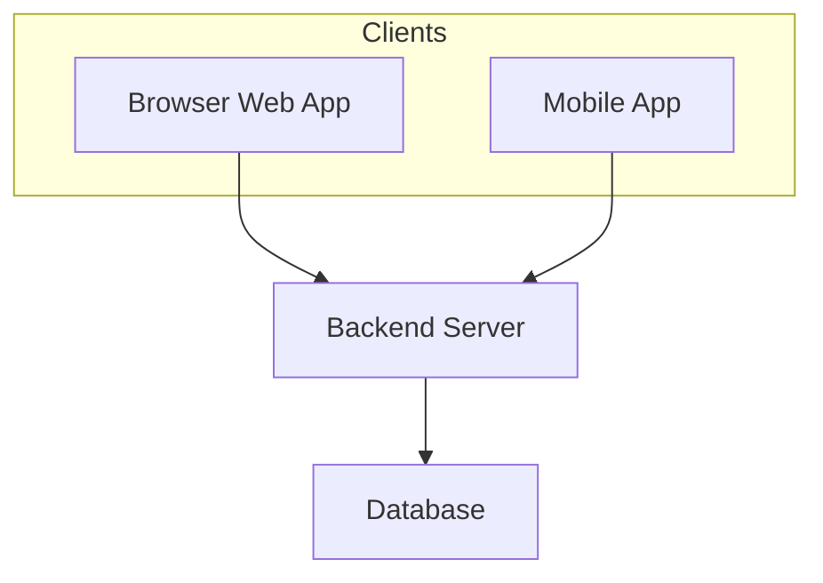

# Chapter 2: Websites and Mobile Applications

## Learning Objectives

By the end of this chapter, you should be able to:

1. Define what a website is and how users access it.
2. Distinguish static websites, dynamic websites, and web applications.
3. Explain how mobile apps differ from websites/web apps.
4. Compare native, hybrid, and progressive web apps at awareness level.
5. Recommend website vs mobile app (or both) for a simple product scenario.

---

## 1. Why This Matters

In Chapter 1, you learned that software comes in many forms. In industry, two of the most common product forms are:

* **websites / web applications** (browser-based);
* **mobile applications** (phone/tablet apps).

If you choose the wrong form early, you waste time and money.

Examples:

* A restaurant may only need a **website** with menu + location.
* A food delivery business usually needs a **mobile app** (and often a web version too).
* A college event booking MVP may start as a **web app**, then add mobile later.

As an AI-powered full-stack developer, you must explain these choices clearly to clients and teammates.

---

## 2. Core Concepts

### 2.1 What Is a Website?

**Website definition:** A collection of related web pages accessible through a browser using a URL (domain).

Examples: a college brochure site, a company “About Us” site, a blog, Wikipedia.

**How users access a website:**

1. Open a browser (Chrome, Edge, Safari, Firefox).
2. Enter a domain (e.g., `example.com`) or click a link.
3. Browser requests content from a server.
4. Browser displays the page.

You studied browser/server/DNS ideas earlier in kickoff material; here the focus is product form.

### 2.2 Website vs Web Application

| | Website (often informational) | Web application |
|--|-------------------------------|-----------------|
| Main purpose | Present information | Let users do tasks |
| Interaction | Mostly reading/clicking links | Login, forms, dashboards, workflows |
| Examples | Marketing page, blog | Gmail, Google Docs, IRCTC booking |

**Web application definition:** A browser-based software product where users perform interactive tasks (often with accounts and stored data).

Many modern products blur the line: a “website” can include app-like features. In conversation, be precise:

* “marketing website”
* “web app with login and dashboard”

### 2.3 Static vs Dynamic (beginner level)

**Static website:** Pages are mostly fixed files. Same content for most visitors.  
Example: a simple portfolio page.

**Dynamic website / web app:** Content can change per user, time, or data.  
Example: your Swiggy cart, Gmail inbox.

Definition is enough for now; backend details come in later modules.

### 2.4 What Is a Mobile Application?

**Mobile app definition:** Software installed on a phone/tablet (usually via App Store / Play Store) designed for mobile use.

Examples: PhonePe, Instagram, Uber, WhatsApp.

Common mobile strengths:

* camera / GPS / sensors;
* push notifications;
* offline or low-connectivity patterns (sometimes);
* home-screen convenience.

### 2.5 Mobile Apps vs Websites / Web Apps

| Factor | Website / Web app | Mobile app |
|--------|-------------------|------------|
| Access | Browser + URL | Install from store |
| Installation | Usually none | Required |
| Updates | Deploy to server; users get latest on refresh | Often via store update |
| Device features | Limited compared to native apps | Strong access (camera, GPS, etc.) |
| Discovery | Search / links / ads | Store search + install |
| Best for | Fast reach, content, dashboards, MVPs | Frequent daily use, mobile-first journeys |

**Important:** Many companies ship **both**.

Example: Instagram has mobile apps and a web version.

### 2.6 Types of Mobile Apps (ecosystem awareness)

**Native app:** Built specifically for one platform (Android or iOS) using platform technologies.  
Usually best performance and deepest device integration.

**Cross-platform / hybrid approaches:** One codebase aims to run on multiple platforms (tools evolve over time; names you may hear: Flutter, React Native).  
Awareness only — not taught as a full course here.

**PWA (Progressive Web App):** A web app enhanced to feel more app-like (installable in some cases, offline capabilities in some cases).  
Trend awareness for 2025–2026: useful when you want app-like reach without full store-first strategy.

Do not memorize framework deep dives now. Know that options exist.

---

## 3. How It Works

### User journey comparison

```text
Website/Web app:
User → Browser → Domain/URL → Server → Page/App UI

Mobile app:
User → Install app → Open app icon → App talks to server APIs → UI updates
```

### Shared reality

Both websites and mobile apps often depend on:

* servers;
* databases;
* authentication;
* internet connectivity.

So “mobile vs web” is about **client experience and distribution**, not whether backend exists.



---

## 4. Syntax / Commands / Implementation

No coding syntax in this chapter.

Professional phrasing practice:

| Prefer | Avoid |
|--------|-------|
| “MVP as a responsive web app, then Android if retention is strong.” | “Make app and website everything now.” |
| “This is mostly informational, so a static marketing site is enough.” | “We need an app because every business needs an app.” |

---

## 5. Practical Examples

### Example 1 — Simple

A tutor wants to publish fees and contact info.  
**Fit:** Simple website.

### Example 2 — Practical

Users book salon appointments, view history, get reminders.  
**Fit:** Web app MVP first; mobile app later if daily engagement is high.

### Example 3 — Continuous product thinking

Your course product may start as:

1. landing website (Modules 6–8);
2. interactive web product (Modules 9–14);
3. optional future mobile client (awareness for later career work).

---

## 6. Common Mistakes

1. **“Every product needs a mobile app on day 1.”**  
   Many MVPs succeed as web apps first.

2. **Calling every browser product a “website” only.**  
   If users log in and manage data, call it a web application.

3. **Assuming mobile apps work without internet.**  
   Many still need servers for login/data.

4. **Ignoring responsive web.**  
   A good web app on phone browsers can delay native app cost.

---

## 7. Debugging Guide

When stuck choosing web vs mobile, ask:

1. Where will users be? (desk, field, commute)
2. How often will they use it? (monthly vs daily)
3. Do we need camera/GPS/push strongly?
4. What is budget and timeline?
5. Can a responsive web MVP validate demand first?

---

## 8. Best Practices

### Required fundamentals

* Define website, web app, mobile app correctly.
* Compare access method, install needs, and use cases.

### Professional best practice

* Start with MVP channel that reaches users fastest.
* Plan for multi-platform only when metrics justify it.

### Advanced / learn later

* App store compliance, CI/CD for mobile, deep PWA service workers — later career learning.

---

## 9. Real-World Engineering Context

Product and engineering teams often debate:

> “Do we hire Android/iOS specialists now, or ship web first?”

This affects hiring, release speed, and maintenance cost.

**Trend note (2025–2026):**  
Teams frequently launch web fast, add AI features in-product, then expand to native mobile when usage proves value.

---

## 10. Technology Ecosystem Awareness

| Term | Brief meaning |
|------|---------------|
| Responsive design | Website/layout adapts to screen sizes |
| SPA | Single Page Application style web app |
| API | Backend interface mobile/web clients call |
| App Store / Play Store | Distribution platforms for mobile apps |
| Deep link | Link that opens a specific place in an app/site |

---

## 11. AI-Assisted Development

### Poor prompt

> “Should I make an app?”

### Better prompt

> “I am building a college event booking MVP for students in India. Compare web app vs Android app for first release. Consider cost, speed, and student behavior. Recommend one option with 5 bullet reasons.”

### Spec-based prompt

> **Objective:** Recommend product client type for MVP.  
> **Users:** College students booking club events.  
> **Constraints:** 4-week beginner team, no native mobile experience.  
> **Output:** Recommendation + risks + what to build first.

---

## 12. Reading AI-Generated Work

If AI says “Always build native apps first for credibility,” challenge it:

* Is credibility from stores always required?
* Can web validate demand cheaper?
* What user evidence supports native-first?

---

## 13. Interview Preparation

**Q1. What is a website?**  
A set of related pages accessed via browser and URL.

**Q2. Website vs web app?**  
Website is often informational; web app supports interactive tasks/workflows.

**Q3. Mobile app vs web app?**  
Mobile app is installed on device; web app runs in browser. Different distribution and device-feature access.

**Q4. Why might a startup choose web MVP first?**  
Faster distribution, easier updates, lower initial platform cost.

**Q5. Can one product have both?**  
Yes — many do (mobile + web).

---

## 14. Quick Reference / Cheat Sheet

| Term | One-liner |
|------|-----------|
| Website | Browser pages via URL |
| Web app | Interactive browser software |
| Mobile app | Installed phone/tablet software |
| Static site | Mostly fixed content |
| Dynamic app/site | Content/actions change with data/users |
| PWA | Web app with app-like capabilities |
| Native app | Platform-specific mobile app |

---

## 15. Chapter Summary

You can now explain websites, web apps, and mobile apps, compare them, and make a beginner-level MVP recommendation.

**Next chapter:** How Software Is Built — SDLC, Agile, and how real companies deliver software.
