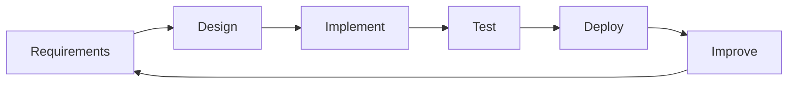

# Chapter 3: How Software Is Built

## Learning Objectives

By the end of this chapter, you should be able to:

1. Define SDLC and list its major stages.
2. Explain Waterfall vs Agile at a practical beginner level.
3. Describe how modern teams use Agile ideas (backlog, sprint, increment).
4. Connect SDLC stages to the continuous product you will build in this curriculum.
5. Recognize related trending delivery practices (CI/CD, DevOps awareness) without deep specialization.

---

## 1. Why This Matters

Software is not built by “opening a laptop and typing randomly until it works.”

Professional teams follow a process so they can:

* understand the problem;
* plan work;
* build in stages;
* test quality;
* release safely;
* improve continuously.

That process family is called the **Software Development Life Cycle (SDLC)**.

If you understand SDLC, you can:

* communicate in standups and interviews;
* estimate work more realistically;
* use AI inside a disciplined process (not chaos);
* avoid building the wrong thing.

---

## 2. Core Concepts

### 2.1 What Is SDLC?

**SDLC (Software Development Life Cycle)** is the structured process teams use to plan, build, test, deploy, and maintain software.

Common stages (names vary by company, idea is stable):

1. **Requirements** — What should it do? For whom?
2. **Design** — How will it look and be structured?
3. **Implementation (Coding)** — Build the software.
4. **Testing** — Find and fix defects; verify behavior.
5. **Deployment** — Release to real users.
6. **Maintenance / Improvement** — Fix issues, add features, monitor.

```text
Requirements → Design → Implementation → Testing → Deployment → Maintenance
                         ↑__________________________________|
```

In modern product work, this is often **iterative** (repeat in smaller cycles), not one giant pass.

### 2.2 Waterfall (classic model)

**Waterfall definition:** A linear approach where each phase largely finishes before the next begins.

Useful historically and still seen in some regulated projects.

Limitation for many digital products: late feedback — users may see value only at the end.

### 2.3 Agile (current industry default mindset)

**Agile definition:** An approach to building software in small, frequent increments with continuous feedback and willingness to adapt.

Agile is not one single tool. It is a set of values/principles used through methods like **Scrum** or **Kanban**.

Key Agile ideas beginners must know:

| Term | Definition |
|------|------------|
| Backlog | Prioritized list of work items |
| User story | Short requirement from user perspective |
| Sprint | Short timebox (often 1–2 weeks) to deliver a slice of value |
| Increment | Usable product improvement produced in a cycle |
| Standup | Short team sync on progress/blockers |
| Retrospective | Team reflection to improve process |

Example user story:

> As a student, I want to book a slot, so that I can attend a mentoring session.

### 2.4 Scrum awareness (definition-level)

**Scrum definition:** A popular Agile framework that uses roles, events, and artifacts (Product Owner, Scrum Master, Developers; sprint planning, daily scrum, review, retrospective).

You do not need to memorize ceremony details deeply yet. Know Scrum is a common way teams practice Agile.

### 2.5 How real companies build software (practical picture)

Real companies typically:

1. Discover a problem/opportunity.
2. Define MVP scope.
3. Design UX flows.
4. Break work into backlog items.
5. Build in sprints.
6. Test continuously.
7. Deploy frequently (sometimes multiple times per week).
8. Observe metrics/feedback.
9. Improve.

**Trending practices (awareness):**

* **DevOps:** Closer collaboration between development and operations for faster reliable delivery.
* **CI/CD:** Continuous Integration / Continuous Delivery (or Deployment) — automatically test and release changes more safely.
* **Product analytics:** Measure usage to guide what to build next.
* **AI-assisted development:** Use AI for drafts, tests, docs — with human review.

Definitions are enough here; tools come later.

---

## 3. How It Works

### Waterfall vs Agile (simple flow)

```text
Waterfall:
Big plan → Big build → Big test → Release (late learning)

Agile:
Small plan → Small build → Test → Release slice → Feedback → Repeat
```

### Mapping to this curriculum’s continuous product

| SDLC stage | Where it appears in curriculum |
|------------|--------------------------------|
| Requirements | Modules 2–3 (problem, users, MVP) |
| Design | Modules 5–6 (UI/UX, branding) |
| Implementation | Modules 7–15 (HTML → Flask → DB → admin) |
| Testing | Module 16 |
| Security review | Module 17 |
| Deployment | Modules 11 and 18 |
| Improvement | Module 19 |
| AI features | Module 20 |
| Launch/demo | Module 22 |

You are not only learning topics — you are practicing an end-to-end life cycle.



---

## 4. Syntax / Commands / Implementation

No programming syntax.

Useful documentation formats you will see:

* requirements list;
* user stories;
* acceptance criteria;
* bug reports.

**Acceptance criteria definition:** Conditions that must be true for a feature to be considered done.

Example:

* User can submit booking form with name, date, and slot.
* Invalid email shows an error message.
* Successful booking shows confirmation.

---

## 5. Practical Examples

### Example 1 — Waterfall-like

Building firmware for a medical device with heavy compliance may favor longer upfront specification.

### Example 2 — Agile product

A startup building an event booking web app releases:

* Week 1: landing + waitlist
* Week 2: booking form
* Week 3: admin list view
* Week 4: email confirmation

Each increment can get user feedback.

### Example 3 — AI inside SDLC

During implementation, a developer uses AI to draft a form validator, then:

* reads the code;
* tests edge cases;
* fixes issues;
* commits only verified work.

AI accelerates coding; SDLC still governs quality.

---

## 6. Common Mistakes

1. Treating Agile as “no planning.”  
   Agile plans in smaller cycles; it does not mean random work.

2. Skipping requirements and jumping to UI.  
   Beautiful screens for the wrong problem still fail.

3. Testing only at the end.  
   Late testing makes fixes expensive.

4. Confusing SDLC stages with tools.  
   Jira/GitHub are tools; SDLC is the process thinking.

---

## 7. Debugging Guide

When a project feels chaotic, check:

1. Are requirements written clearly?
2. Is MVP scope too large?
3. Are we delivering thin slices or waiting for “perfect”?
4. Do we have acceptance criteria?
5. Are bugs tracked and prioritized?

Process problems often look like coding problems.

---

## 8. Best Practices

### Required fundamentals

* Know SDLC stages.
* Know Agile vs Waterfall at concept level.
* Write clear acceptance criteria for features.

### Professional best practice

* Deliver small increments.
* Get feedback early.
* Keep a prioritized backlog.

### Advanced / learn later

* Formal Scrum certifications, SAFe, advanced CI/CD pipelines — later.

---

## 9. Real-World Engineering Context

In interviews, companies ask:

> “Have you worked in Agile?”  
> “What happens after requirements?”  
> “How do you know a feature is done?”

Junior developers who understand life-cycle language sound professional even before deep coding experience.

**2025–2026 note:**  
Teams increasingly combine Agile delivery with AI-assisted implementation, but accountability for quality remains human.

---

## 10. Technology Ecosystem Awareness

| Term | Brief meaning |
|------|---------------|
| Kanban | Visual workflow board method |
| MVP | Minimum Viable Product |
| Issue tracker | Tool for tasks/bugs (e.g., Jira, GitHub Issues) |
| Definition of Done | Team agreement on what “finished” means |
| Release | Version made available to users |

---

## 11. AI-Assisted Development

### Poor prompt

> “Build my project.”

### Better prompt

> “Act as a product teammate. Given this problem and 3 features, draft user stories with acceptance criteria for a 2-week sprint. Do not write code.”

### Spec-based prompt

> **Objective:** Create sprint backlog for event booking MVP.  
> **Users:** Students and club admins.  
> **Must include:** 5 user stories, priority order, acceptance criteria.  
> **Constraints:** Web only, no payments yet.

---

## 12. Reading AI-Generated Work

If AI produces 40 “must-have” features for week 1, challenge scope:

* What is truly MVP?
* What can wait?
* What dependencies exist?

AI can overproduce. Engineers prioritize.

---

## 13. Interview Preparation

**Q1. What is SDLC?**  
Structured process for planning, building, testing, deploying, and maintaining software.

**Q2. Name SDLC stages.**  
Requirements, design, implementation, testing, deployment, maintenance (wording may vary).

**Q3. Waterfall vs Agile?**  
Waterfall is linear/phase-gated; Agile delivers incremental value with frequent feedback.

**Q4. What is a sprint?**  
A short timeboxed iteration where the team delivers a product increment.

**Q5. What are acceptance criteria?**  
Checks that define when a feature is done correctly.

---

## 14. Quick Reference / Cheat Sheet

| Term | One-liner |
|------|-----------|
| SDLC | Life cycle of building/maintaining software |
| Requirements | What to build and why |
| Agile | Incremental delivery + feedback |
| Waterfall | Linear phase-by-phase approach |
| Backlog | Prioritized work list |
| Sprint | Short delivery timebox |
| CI/CD | Automated integrate/test/release practices |
| DevOps | Dev + ops collaboration for delivery |

---

## 15. Chapter Summary

You now understand how software moves from idea to release and improvement, including Agile as the dominant modern approach.

**Next chapter:** Software Engineering Teams & Careers — who does what, and which paths exist for you.
