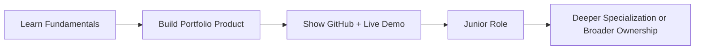

# Chapter 4: Software Engineering Teams & Careers

## Learning Objectives

By the end of this chapter, you should be able to:

1. Identify common roles on a software team and what each role owns.
2. Explain how roles collaborate across SDLC stages.
3. Describe major career paths in software engineering (including AI-era roles).
4. Position yourself as an aspiring AI-powered full-stack developer.
5. Use professional language when discussing teams, ownership, and growth.

---

## 1. Why This Matters

Software is a team sport.

Even in early-stage startups where one person wears many hats, professional software still involves multiple responsibilities:

* understanding users;
* designing interfaces;
* writing frontend/backend code;
* testing;
* securing systems;
* deploying;
* supporting users.

If you only know “coder” as a title, you will misunderstand job posts and collaboration.

This chapter helps you see where you fit and how to grow toward employability in 2026.

---

## 2. Core Concepts

### 2.1 Common Software Team Roles

| Role | Core responsibility |
|------|---------------------|
| Product Manager (PM) | Defines problem/priorities; aligns business and users |
| UI/UX Designer | Designs usable flows and interfaces |
| Frontend Developer | Builds user-facing interface (browser/app UI) |
| Backend Developer | Builds server logic, APIs, data handling |
| Full-Stack Developer | Works across frontend + backend (breadth) |
| QA / Test Engineer | Ensures quality through testing strategy |
| DevOps / Platform Engineer | Improves deployment, infrastructure, reliability |
| Security Engineer | Reduces security risk; secure design reviews |
| Data / ML Engineer | Data pipelines and ML systems (specialized) |
| Engineering Manager | People + delivery leadership for a team |

**Definitions (sufficient):**

* **Frontend:** The part users see and interact with.
* **Backend:** Server-side logic, APIs, databases.
* **Full-stack:** Ability to contribute across frontend and backend for a feature/product slice.

### 2.2 How teams collaborate

Example feature: “Student can reset password.”

* PM clarifies requirement and priority.
* Designer defines screens and empty/error states.
* Frontend builds form/UI states.
* Backend handles reset tokens/email logic.
* QA tests valid/invalid cases.
* DevOps ensures email config works in production.
* Security reviews token expiry and abuse risks.

One feature, many owners.

### 2.3 Career paths in software engineering

Common junior entry paths:

1. **Junior Frontend Developer**
2. **Junior Backend Developer**
3. **Junior Full-Stack Developer**
4. **QA / Automation trainee**
5. **Support Engineer → Developer transition**
6. **AI-assisted Developer / AI Application Developer** (emerging job-market language)

Related non-engineering but adjacent careers:

* Product Management
* UI/UX Design
* Technical Writing
* Developer Advocacy

### 2.4 What “AI-Powered Full-Stack Developer” means in this program

You are training to:

* understand end-to-end product building;
* write and read enough code manually to stay in control;
* use AI for speed with verification;
* communicate with product/design/QA language;
* ship a portfolio product.

This is a **breadth-first employability path**, not instant specialization in every framework.

### 2.5 Skills employers look for (practical)

| Category | Examples |
|----------|----------|
| Technical fundamentals | HTML/CSS/JS, backend basics, databases, Git, deployment basics |
| Problem solving | Debugging, breaking requirements down |
| Communication | Clear updates, asking good questions |
| AI fluency | Prompting, reviewing AI code, knowing limits |
| Professional habits | Testing mindset, security awareness, ownership |

**Trend (2025–2026):**  
Job descriptions increasingly mention AI tools, but still require fundamentals, Git, and ability to explain your work.

---

## 3. How It Works

### Team in the SDLC

```text
PM/Design heavy at start → Developers heavy in build → QA continuous → DevOps at release → All in improvement
```

### Growth ladder (simplified)

```text
Beginner student
 → Portfolio projects + GitHub
 → Intern / Junior developer
 → Mid-level (owns features)
 → Senior (owns systems + mentors)
```

Titles vary by company. Focus on demonstrable skills.



---

## 4. Syntax / Commands / Implementation

No code syntax.

Professional communication templates:

**Standup update:**
> Yesterday: finished booking form layout.  
> Today: wire form validation.  
> Blocker: unclear error message copy from design.

**Clarifying question:**
> For MVP, should guests book without login, or is account required?

---

## 5. Practical Examples

### Example 1 — Startup team of 3

* One founder-PM
* One designer-developer
* One full-stack developer

Roles overlap; ownership still needs clarity.

### Example 2 — Product company team

Separate PM, design, frontend, backend, QA, DevOps.

### Example 3 — Your path in this course

You will act like a small product team member across modules: ideation → design → build → test → deploy → improve → demo.

---

## 6. Common Mistakes

1. Thinking only “coding talent” matters.  
   Communication and debugging matter equally for juniors.

2. Trying to learn 20 frameworks before shipping one product.  
   Breadth with one shipped project beats shallow name-dropping.

3. Hiding AI use or depending on AI blindly.  
   Employers care that you can explain and verify.

4. Ignoring soft collaboration skills.  
   Missed standups and unclear blockers hurt teams.

---

## 7. Debugging Guide

If your career plan feels confusing:

1. Pick target role family (full-stack junior is fine).
2. Map required fundamentals from real job posts.
3. Build one end-to-end project proving those skills.
4. Publish GitHub + live link + short demo.
5. Practice explaining architecture in plain English.

---

## 8. Best Practices

### Required fundamentals

* Know major team roles.
* Know frontend/backend/full-stack meanings.
* Keep a portfolio mindset from day one.

### Professional best practice

* Own outcomes, not only tasks.
* Write clear status updates.
* Seek feedback early.

### Advanced / learn later

* Staff/principal engineer tracks, EM track, specialized SRE — after foundation years.

---

## 9. Real-World Engineering Context

Hiring managers often ask:

* “What did you build?”
* “What part did you own?”
* “How did you debug a hard issue?”
* “How do you use AI in your workflow?”

Your answers should show process maturity from Module 1, not only tool names.

---

## 10. Technology Ecosystem Awareness

| Term | Brief meaning |
|------|---------------|
| Intern | Time-bound learning role |
| IC | Individual contributor (non-manager technical path) |
| On-call | Rotation supporting production incidents |
| Code review | Peers inspect changes before merge |
| Portfolio | Public proof of skills and projects |

---

## 11. AI-Assisted Development

### Poor prompt

> “How do I get a software job?”

### Better prompt

> “I am a beginner in an AI-powered full-stack program. Create a 90-day skill plan for a junior full-stack role in India. Include weekly milestones for HTML/CSS/JS, Git, one deployed project, and interview practice. No advanced ML.”

### Spec-based prompt

> **Objective:** Draft my LinkedIn About section.  
> **Audience:** Recruiters hiring junior developers.  
> **Must include:** current training focus, project goal, AI-assisted but fundamentals-first approach.  
> **Constraints:** 120–150 words, no exaggerated claims.

---

## 12. Reading AI-Generated Work

If AI writes “Expert in React, Kubernetes, and LLMs” for your profile after week 1, reject it.

Accurate self-representation is a professional skill.

---

## 13. Interview Preparation

**Q1. Difference between frontend and backend?**  
Frontend is user interface side; backend is server/data/logic side.

**Q2. What does a full-stack developer do?**  
Works across UI and server-side parts to deliver features end-to-end.

**Q3. Name 4 roles on a software team.**  
Any accurate set: PM, designer, frontend, backend, QA, DevOps, etc.

**Q4. How do roles work together?**  
Shared feature ownership across requirements, design, build, test, release.

**Q5. What should a junior showcase?**  
Projects, GitHub, deployed links, clear explanation of decisions and debugging.

---

## 14. Quick Reference / Cheat Sheet

| Term | One-liner |
|------|-----------|
| PM | Prioritizes product outcomes |
| UI/UX | Designs usable experience |
| Frontend | Client UI implementation |
| Backend | Server/API/data implementation |
| Full-stack | Cross-layer feature delivery |
| QA | Quality verification |
| DevOps | Delivery & reliability practices |
| AI-powered developer | Uses AI with engineering judgment |

---

## 15. Chapter Summary

You now understand software teams, collaboration, and career pathways — including how this program targets AI-powered full-stack employability.

**Next:** Module 1 Assessment (Exercises + Quiz + Assignment) covering Chapters 1–4.
