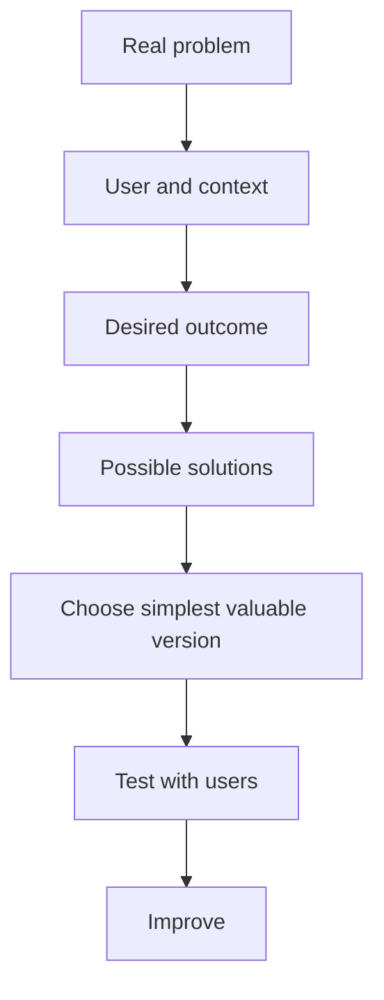

# Chapter 2: Innovation & Product Thinking

## Learning Objectives

By the end of this chapter, you should be able to:

1. Define innovation in practical terms (not buzzwords).
2. Distinguish invention, innovation, and copying with minor changes.
3. Use product thinking: users, value, and outcomes over features.
4. Evaluate ideas with simple “value vs complexity” judgment.
5. Improve a weak idea into a clearer product direction through class discussion.

---

## 1. Why This Matters

Many beginners think:

> “Innovation = something never seen on Earth.”

In ground reality, most successful products are **better solutions to known problems**.

* UPI did not invent money transfer. It made it faster and simpler.  
* Google Docs did not invent documents. It made collaboration easier.  
* Canva did not invent design. It made design accessible.

Your job in this course is **product thinking**: solve a real problem in a useful, shippable way.

---

## 2. Core Concepts

### 2.1 What is innovation?

**Innovation definition:** Creating a useful improvement that people actually adopt.

Innovation can be:

* a new product;
* a better process;
* a simpler experience;
* a cheaper/faster way to get the same result.

**Teacher prompt:**  
“Is a QR menu in a restaurant innovation?”  
Students debate 2 minutes.

Possible class conclusion:  
Yes, if it reduces printing cost/waiting and customers prefer it. Innovation is measured by usefulness + adoption, not novelty alone.

---

### 2.2 Invention vs innovation vs feature copy

| Term | Meaning | Example |
|------|---------|---------|
| Invention | Creating something fundamentally new | Early touchscreen concepts |
| Innovation | Useful adoption of improvement | Smartphones making touch computing mainstream |
| Feature copy | Adding same button as competitors without clearer value | “Add stories because Instagram has stories” |

**Student check:**  
If your idea is “Uber but for my colony,” ask: what is meaningfully better for that colony?

---

### 2.3 Product thinking

**Product thinking definition:** Deciding what to build based on user value and outcomes, not based on random features or trendy tech.

Product thinkers ask:

1. Who is the user?  
2. What job are they trying to get done?  
3. What is painful today?  
4. What does success look like for them?  
5. What is the smallest useful product we can ship?

**Feature thinking (weak):**  
“Let’s add chat, AI, payments, stories, maps, and crypto.”

**Product thinking (strong):**  
“Club members fail to register for events on time. Success = registration completed in under 2 minutes with confirmation.”

---

### 2.4 Value vs complexity (beginner decision tool)

Draw this mentally:

```text
High value + Low complexity  → Build first
High value + High complexity → Maybe later / simplify
Low value  + Low complexity  → Optional polish
Low value  + High complexity → Avoid
```

**Relatable example:**

Idea: Campus lost-and-found

* High value feature: post lost item + contact method  
* Lower urgency: AI image recognition for matching items in week 1  

Product thinking picks the high-value simple path first.

---

## 3. Interactive Lesson Flow (Teacher + Students)

### Round 1 — Relatable product autopsy (15 min)

Teacher asks class to pick one app everyone knows (WhatsApp / PhonePe / Swiggy).

Discuss:

* What problem does it own?  
* What is the “job to be done”?  
* What is one feature that directly serves that job?  
* What is one feature that is secondary?

Students speak; teacher captures on board.

### Round 2 — Upgrade a weak idea (15 min)

Teacher writes a weak idea:

> “An app with AI for students.”

Class rebuilds it using product thinking:

1. Which students?  
2. Which moment of pain?  
3. What outcome?  
4. What is version 1?

Example improved direction:

> “For final-year students who miss internship deadlines: a deadline tracker with reminders and checklist. No AI required in v1.”

### Round 3 — Mini pitch & critique (15 min)

Each pair shares:

* problem;
* user;
* proposed improvement;
* why better than current workaround.

Peers ask only two questions:

1. “How do you know this pain is real?”  
2. “What will you NOT build in v1?”

---

## 4. How It Works



Innovation in this course = repeated loop of useful improvement, not one magical idea.

---

## 5. Practical Grounded Examples

### Example 1 — Tuition center
Current workaround: WhatsApp broadcast for homework.  
Pain: messages get buried.  
Innovative-enough MVP: class board web page with dated homework posts.

### Example 2 — PG/hostel mess
Current workaround: verbal menu changes.  
Pain: students come and find item unavailable.  
MVP: daily menu + “available/not available” update by manager.

### Example 3 — Over-innovating
“AI robot waiter for mess.”  
Interesting, expensive, hard for beginners — poor course fit.

---

## 6. Common Mistakes

1. Equating innovation with AI/blockchain buzzwords.  
2. Adding features to look advanced.  
3. Building for “everyone.”  
4. Ignoring existing workarounds (WhatsApp, Excel, notebooks). Your product must beat the workaround somehow.

---

## 7. Best Practices

* Improve a real workflow by 10 meaningful minutes/day, not “change the world” in week 1.  
* Write the outcome sentence before feature list.  
* Keep a “Not now” list.  
* Borrow known patterns (booking, tracker, board) and adapt to your users.

---

## 8. Technology / Trend Awareness (light)

In 2025–2026, many products add generative AI features.  
Product thinking question remains:

> “Does AI reduce user pain better than a simpler non-AI flow?”

If yes, consider later (Module 20).  
If no, do not force it into MVP.

---

## 9. AI-Assisted Development

### Better prompt for this chapter
> “Here is my problem, user, and current workaround: ... Critique whether my solution is product thinking or feature thinking. Suggest a simpler v1 outcome statement.”

Students must bring their own problem context.

---

## 10. Interview Preparation

**Q: What is product thinking?**  
Focusing on user problem and outcomes before features/tech.

**Q: Give an example of innovation that is not a brand-new invention.**  
Any clearer/faster/cheaper improvement people adopt (e.g., UPI convenience).

**Q: How do you prioritize features?**  
Value to user vs complexity/risk; ship highest-value simple slices first.

---

## 11. Quick Reference

| Term | One-liner |
|------|-----------|
| Innovation | Useful improvement people adopt |
| Product thinking | Outcomes for users over random features |
| Workaround | Current imperfect solution users already use |
| Value | Benefit to user/business |
| Complexity | Effort/risk to build and maintain |
| Not-now list | Features delayed on purpose |

---

## 12. Chapter Summary + Exit Ticket

**Exit ticket:**  
Rewrite your best Chapter 1 problem into this template:

> For **[user]** who struggles with **[problem]**, success means **[outcome]**.  
> My v1 will help by **[simple improvement]**.  
> I will NOT build **[not-now items]** yet.

**Next chapter:** From Ideas to Projects — brainstorm many options, then choose one project for the full course.
