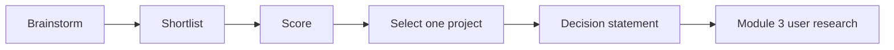

# Chapter 3: From Ideas to Projects

## Learning Objectives

By the end of this chapter, you should be able to:

1. Run a structured brainstorming session without judging ideas too early.
2. Convert many ideas into a shortlist using clear criteria.
3. Choose one course project that is meaningful, buildable, and continuous across modules.
4. Write a simple project decision statement your teacher can approve.
5. Understand what makes a “good enough” project for learning full-stack development.

---

## 1. Why This Matters

This chapter locks your **continuous product** for the curriculum.

Outcome of Module 2:

> Students identify a real-world problem and select a potential software product they can develop throughout the course.

If you pick too late, your HTML/CSS/JS/backend work becomes disconnected demos.  
If you pick too broadly, you drown.  
If you pick something fake, motivation dies.

We choose like builders in the real world: many ideas → criteria → one commitment.

---

## 2. Core Concepts

### 2.1 Brainstorming

**Brainstorming definition:** Generating many possible ideas quickly before evaluating them.

Rules for class brainstorming:

1. Quantity first.  
2. No mocking ideas in round 1.  
3. Build on others’ ideas.  
4. Keep ideas tied to real problems from Chapter 1.  
5. Evaluate only after the timer ends.

**Teacher setup:**  
8 minutes silent sticky-note brainstorm → 7 minutes share to board → then filtering.

---

### 2.2 Idea types students can relate to

Encourage practical domains:

* campus operations;
* tuition/coaching workflows;
* local shop appointments;
* family expense/medicine reminders;
* community/society helpdesks;
* student career prep trackers.

Avoid as first course product:

* full marketplace like Amazon;
* full Uber clone;
* heavy AI research platform;
* anything needing regulated medical diagnosis claims;
* ideas requiring large paid APIs on day 1.

---

### 2.3 Choosing the right project (decision criteria)

Score each shortlisted idea 1–5:

| Criterion | Question |
|-----------|----------|
| Real pain | Do we know people who feel this? |
| Access to users | Can we interview/test with them this month? |
| Narrow MVP | Can first version be tiny but useful? |
| Learning fit | Will it need UI + later backend/data? |
| Motivation | Will we care about this for months? |
| Ethics/safety | Is it responsible for beginners? |

**Rule of thumb:**  
Prefer total score strength + no red flags over “most exciting sounding.”

---

### 2.4 Project decision statement

Use this template:

> We are building **[product name]** for **[users]**  
> to solve **[problem]**  
> by providing **[MVP capability]**  
> first on **[web app / website]**  
> because **[why this form]**.  
> Success for v1 means **[measurable/observable outcome]**.

Example:

> We are building **CampusSlot** for college club members  
> to solve messy event registration on WhatsApp  
> by providing a simple event page + registration form + attendee list  
> first as a web app  
> because students can open links quickly without install friction.  
> Success for v1 means a club can publish one event and collect registrations in one place.

---

## 3. Interactive Lesson Flow

### Block A — Brainstorm (15 min)

Teacher reminds: use your Chapter 1 problems.

Students generate at least **8 idea titles** each (can be rough).

Examples:

* Mess Menu Board  
* Assignment Deadline Nudge  
* Salon Queue Lite  
* PG Complaint Log  
* Lab Equipment Request Form  

### Block B — Rapid filtering (10 min)

Cross out ideas that are:

* not a software problem;
* impossible in course timeline;
* have no reachable users;
* only chosen for buzzwords.

### Block C — Score top 3 (15 min)

Pairs score top 3 ideas with the criteria table.  
Teacher coaches teams that are stuck between two options.

### Block D — Decision + peer challenge (15 min)

Each student/team reads decision statement aloud.  
Two peer questions mandatory:

1. “Who will you talk to this week?”  
2. “What is your Not-now list?”

Teacher gives provisional approval or asks for narrowing.

---

## 4. How It Works

```text
Many ideas
  → Filter by reality
  → Score by criteria
  → Choose one
  → Write decision statement
  → Carry into Module 3 (users, stories, MVP details)
```



---

## 5. Practical Examples of Good Course Projects

| Project | Why it fits |
|---------|-------------|
| Tuition fee & due-date tracker | Clear users, data, forms, admin later |
| Campus event registration | Web MVP, lists, status, notifications later |
| Local salon appointment book | Classic booking flow through curriculum |
| Neighborhood complaint desk | Forms + admin dashboard path |
| Personal medicine reminder log | Simple start, can grow carefully |

All can progress through HTML → CSS → JS → Git → deploy → Flask → DB → admin → testing → security → deploy again.

---

## 6. Common Mistakes

1. Choosing 3 products “just in case.” Commit to one.  
2. Choosing a problem you refuse to research.  
3. Naming the product before clarifying the problem.  
4. Selecting an idea only because AI suggested it.  
5. Expanding MVP during the choice meeting (“also chat, payments, AI, video…”).

---

## 7. Best Practices

* Pick boring-but-real over glamorous-but-fake.  
* Ensure your product has at least one form + one list view eventually.  
* Keep users reachable (classmates, family, local shops).  
* Revisit decision if user talks in Module 3 kill the assumption — that is professional, not failure.

---

## 8. AI-Assisted Development

### Useful AI help
* rephrasing decision statements;
* listing risks for a chosen idea;
* suggesting Not-now features.

### Not allowed as replacement
* “AI, invent my project because I don’t want to think.”

### Better prompt
> “Here are 3 scored ideas with users and constraints. Ask me 5 clarifying questions, then recommend which one best fits a beginner full-stack continuous project. Do not invent new domains.”

---

## 9. Interview Preparation

**Q: How do you choose what to build?**  
Start from real problems, brainstorm options, score by user value and feasibility, commit to an MVP scope.

**Q: What makes a strong portfolio project?**  
Real problem, clear users, shipped increments, and ability to explain tradeoffs.

**Q: What would you cut from v1?**  
Anything not required for the core outcome (payments, AI, multi-role complexity, etc. unless essential).

---

## 10. Quick Reference

| Term | Meaning |
|------|---------|
| Brainstorming | Idea generation before judgment |
| Shortlist | Reduced candidate set |
| Decision criteria | Scoring factors for choice |
| Project commitment | One product carried through course |
| Decision statement | Clear summary of what/for whom/why |
| Not-now list | Conscious exclusions from MVP |

---

## 11. Chapter Summary + Exit Ticket

**Exit ticket (mandatory for Module 2 outcome):**

Submit your project decision statement + Not-now list (3 items) + 2 real people you can speak to about this problem.

**Next:** Module 2 Assessment (practice + quiz + outcome assignment), then Module 3 will deepen users, stories, and MVP definition for this chosen product.
